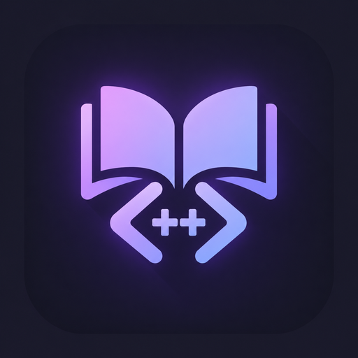
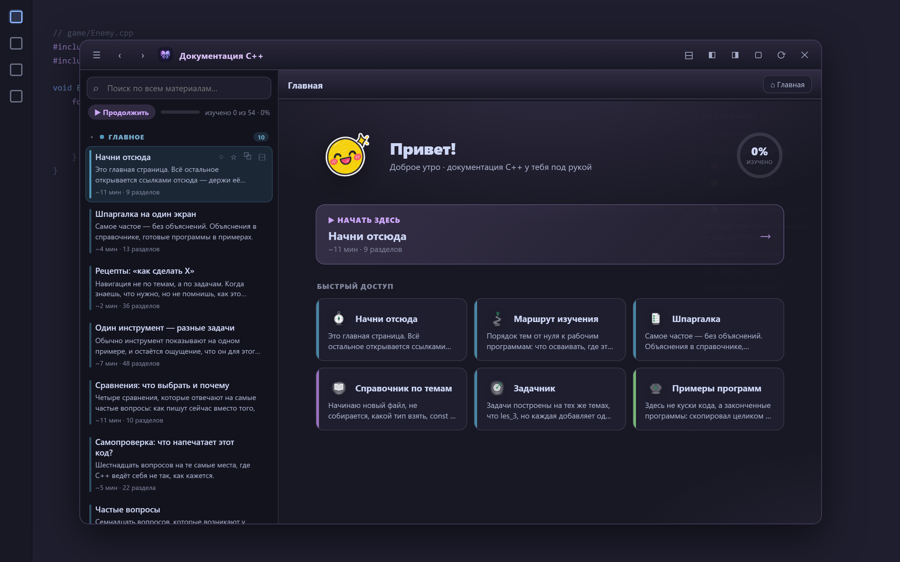
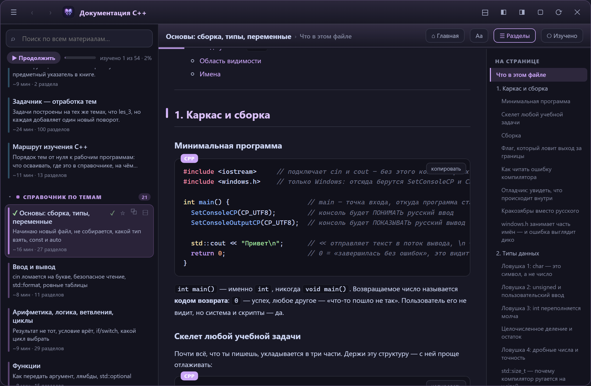
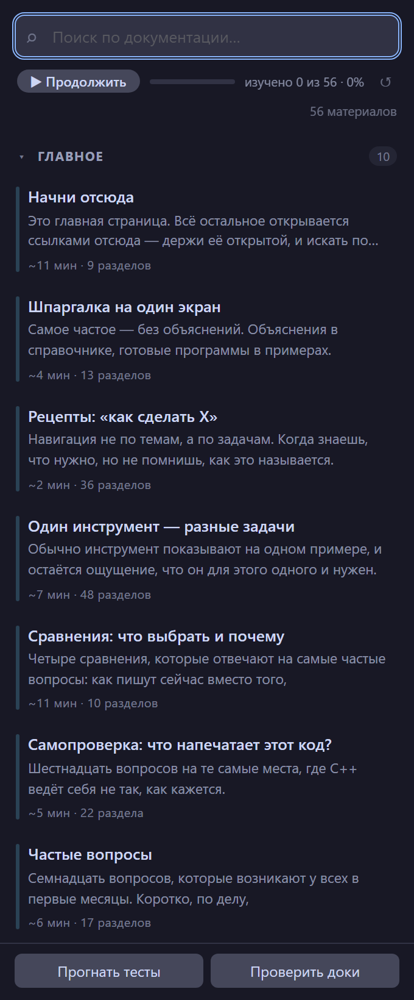

<div align="center">

**Русский** · [English](README.en.md)



# Документация C++

### Весь справочник проекта в VS Code — плавающее окно-читалка поверх редактора и боковая панель

Плавающее окно (перетаскивается, тянется) · чтение с подсветкой C++ прямо в окне<br>
поиск по содержимому · оглавление и переходы по внутренним ссылкам · прогресс изучения · ноль зависимостей

[](https://github.com/moonlivedt-oss/cpp-panel-Moon/actions/workflows/ci.yml)




<sub>Один файл расширения · собственный упаковщик .vsix · установка одной командой</sub>

</div>

---

## Быстрый старт

```bash
npm run install:vsix     # собрать пакет и сразу поставить в VS Code
```

Затем перезапусти редактор — иконка книги появится в панели действий, а в статусбаре снизу —
кнопка **«C++»**.

Отдельно:

```bash
npm run package          # только собрать dist/cpp-docs-panel-<версия>.vsix
npm test                 # смоук-тест (154 проверки, VS Code не нужен)
npm run check            # синтаксис + тесты
npm run preview:window   # собрать build/preview-window.html — посмотреть окно в браузере
```

Удалить: `Ctrl+Shift+X` → «Документация C++» → Uninstall.

> Расширение раздаётся собственным `.vsix`, в маркетплейсе его пока нет. Обновление — повторный
> `npm run install:vsix`.

## Что это

Документация проекта по C++ разрослась: справочник на 12 файлов, девять примеров программ,
шпаргалка, рецепты, указатель. Держать это в дереве файлов неудобно — имена вроде
`06-konteynery.md` ничего не говорят, и каждый раз приходится вспоминать, где что лежит.

**Документация C++** показывает то же самое человеческим языком: заголовок и описание каждого
файла, сгруппированные по смыслу, с поиском по всему тексту — и открывает материал в
**плавающем окне-читалке** поверх редактора, с подсветкой синтаксиса и переходами по ссылкам.

| | Дерево файлов | Обычный Markdown-превью | Документация C++ |
|---|---|---|---|
| Понятные подписи | нет (`06-konteynery.md`) | нет | **да — заголовок и описание из самого файла** |
| Группировка по смыслу | нет | нет | **да — справочник / примеры / инструменты, свои маркеры** |
| Поиск по тексту файлов | нет | нет | **да — по названию, описанию и содержимому, несколько слов, ё/е** |
| Время чтения и объём | нет | нет | **да — «~N мин» и число разделов у каждого материала** |
| Прогресс изучения | нет | нет | **да — «изучено N из M · %» + кнопка «Продолжить»** |
| Оглавление файла | нет | частично | **да — разделы `##`/`###`, прыжок к нужной строке** |
| Переходы по внутренним ссылкам | нет | нет | **да — между файлами, с прыжком к якорю** |
| Чтение поверх редактора | нет | отдельная вкладка | **да — плавающее окно, перетаскивается и тянется** |
| Задачи проекта | нет | нет | **да — «прогнать тесты» / «проверить доки» из `tasks.json`** |
| Внешние зависимости | — | — | **нет (0 npm-пакетов)** |

---

## Возможности

| Возможность | Подробности |
|---|---|
| **Список материалов** | группы «Закреплённое», «Недавнее», «Главное», «Справочник по темам», «Примеры программ», «Один инструмент — разные задачи», у каждой свой цветовой маркер и счётчик |
| **Живые подписи** | заголовок берётся из первого `#` файла, описание — из первой строки цитаты `>`; новые файлы появляются сами, править код не нужно |
| **Время чтения** | у каждого материала — оценка «~N мин» и число разделов: видно объём с одного взгляда |
| **Поиск** | по названию, описанию **и тексту файлов**; **несколько слов** (`map вектор` — оба); без учёта регистра **и ё/е** («всё» находит «все»); совпадения подсвечиваются, точные — сверху, для находок в тексте виден фрагмент-контекст; при пустой выдаче показывает, что искали |
| **Прогресс и «Продолжить»** | полоса «изучено N из M · %», кнопка **«Продолжить»** открывает следующий неизученный материал по порядку; отметку «изучено» можно ставить и снимать вручную (кружок / галочка при наведении) |
| **Всегда свежее** | панель следит за `*.md` и обновляется сама; зелёная точка у изменённых за сутки файлов |
| **Клавиатура** | `↑` `↓` `PageUp` `PageDown` выбрать · `Enter` открыть · `Esc` очистить · `/` или `Ctrl+K` в поиск · `Ctrl+Alt+D` открыть панель и встать в поиск |
| **Сворачивание групп** | клик по заголовку; состояние и текст поиска переживают переключение вкладок |
| **Закреплённое** | звёздочка при наведении прикрепляет материал в группу наверху; сохраняется между сессиями |
| **Оглавление** | у пункта раскрывается список разделов (`##`/`###`); клик открывает файл сразу на нужной строке |
| **Видно, где ты** | пункт файла, открытого сейчас в редакторе, подсвечивается в списке |
| **Открытие** | клик — режим чтения (превью Markdown); правый клик — как обычный текст |
| **Недавнее под рукой** | последние открытые сверху; очистить — крестиком в шапке группы |
| **Кнопки задач** | «Прогнать тесты» и «Проверить доки» запускают задачи VS Code из `tasks.json` |
| **Цвета и доступность** | цвета из активной темы (`--vscode-*`); активный пункт объявляется скринридеру (combobox + `aria-activedescendant`); при системном «меньше движения» анимации отключаются |

---

## Плавающее окно (главное в 3.0)

Кроме боковой панели есть **плавающее окно-читалка** поверх редактора. Его можно **таскать за
заголовок** и **тянуть за края**; позиция и размер запоминаются. Слева — навигатор по всем
материалам (группы, поиск, прогресс, закладки), справа — сам текст: аккуратная типографика,
**подсветка C++/bash**, кнопки **«копировать код»**, таблицы, врезки, **оглавление файла** и
**переходы по внутренним ссылкам** между файлами с прыжком к нужному разделу. Тема
(светлая / тёмная) берётся из VS Code.

**Как включить.** Окно рисует `cpp-docs-runtime.js`, внедрённый в оболочку VS Code загрузчиком —
**Custom UI Style** (`subframe7536.custom-ui-style`, живучее, переживает обновления редактора)
или **Custom CSS and JS** (`be5invis.vscode-custom-css`). Установи загрузчик, затем:

1. Палитра команд → **«Документация C++: подключить плавающее окно»** (или кнопка-окно в шапке
   панели) → «Применить» / «Включить Custom CSS».
2. После перезагрузки окна нажми плавающую пилюлю **«C++»** справа внизу редактора.

Отключить — команда **«Документация C++: отключить плавающее окно»**; проверить состояние —
**«…проверить плавающее окно»**. Боковая панель при этом остаётся как запасной вариант.

<div align="center">

</div>

## Рекомендуемый компаньон: MoonLight custom-bg

Не обязателен, но с ним приятнее. **MoonLight custom-bg** (id `moonlivedt.moonlight-custom-bg-setup`) —
живой фон и темы для VS Code. Если он установлен, плавающее окно берёт его **живой акцент**
(`--mlbg-accent`, обычно вычисленный из обоев): окно совпадает по цвету с остальным интерфейсом
и само меняется вслед за сменой обоев или слайд-шоу.

Это чистое улучшение вида, а не требование. Без custom-bg всё работает: акцент берётся из
активной темы VS Code (`--vscode-focusBorder` и т.п.), а если и его нет — запасной синий.
Ставить и обновлять custom-bg отдельно от панели не нужно; они независимы.

Пока custom-bg раздаётся как локальный `.vsix` (в маркетплейсе его нет) — устанавливается тем
же способом, что и эта панель.

---

## Как пользоваться

После установки материал открывается тремя способами — выбирай под ситуацию:

- **Плавающее окно** (главное) — пилюля **«C++»** справа внизу редактора (нужен загрузчик, см.
  выше). Читалка поверх кода, ничего не занимает в макете.
- **Боковая панель** — иконка книги в панели действий слева. Узкая, всегда под рукой.
- **Отдельная панель** — во всю ширину области редактора: кнопка **«C++»** в статусбаре, стрелка
  в шапке вьюхи сайдбара или команда **«Документация C++: открыть меню отдельной панелью»**
  (`Ctrl+Alt+M`). Удобно, когда в сайдбаре тесно.

Все три показывают один и тот же список и синхронизированы: закладки, «недавнее» и подсветка
открытого файла общие.

<div align="center">

</div>

### Горячие клавиши

| Клавиши | Действие |
|---|---|
| `Ctrl+Alt+D` | Открыть панель и встать в поиск |
| `Ctrl+Alt+M` | Открыть меню отдельной панелью (во всю ширину) |
| `/` или `Ctrl+K` | Встать в поиск (когда панель в фокусе) |
| `↑` `↓` `PageUp` `PageDown` | Выбор материала |
| `Enter` | Открыть выбранный · `Esc` — очистить поиск |

---

## Настройки

| Настройка | По умолчанию | Смысл |
|---|---|---|
| `cppDocs.path` | *(пусто)* | где искать документацию, если проект открыт не из своей папки |
| `cppDocs.openInPreview` | `true` | открывать файлы в режиме чтения; `false` — как текст |

Папка ищется в таком порядке: `docs` внутри открытого проекта → корень открытого проекта →
значение `cppDocs.path`. Если ничего не нашлось, панель покажет подсказку, а не пустоту.

---

## FAQ / Решение проблем

**Плавающая пилюля «C++» не появляется.**
Окно рисует загрузчик custom-css. Проверь, что установлен **Custom UI Style** или **Custom CSS
and JS**, выполнена команда **«…подключить плавающее окно»** и окно перезагружено. Состояние
покажет команда **«Документация C++: проверить плавающее окно»**.

**После обновления VS Code окно пропало.**
Это ограничение механизма custom-css, не расширения. С **Custom UI Style** патч переживает
обновления; с **Custom CSS and JS** его нужно включать заново (**Enable Custom CSS and JS** +
перезапуск). Боковая панель работает всегда, без загрузчика.

**Панель пустая / «документация не найдена».**
Материалы ищутся в `docs/` открытого проекта, затем в его корне, затем по `cppDocs.path`. Открой
папку с документацией как проект или пропиши путь в настройке `cppDocs.path`.

**Кнопки «Прогнать тесты» / «Проверить доки» ничего не делают.**
Они запускают задачи VS Code с именами «C++: прогнать тесты» и «Документация: проверить» из
`tasks.json` проекта. Нет таких задач — VS Code скажет об этом сам.

**Нашёл баг или есть идея.**
Открой [issue](https://github.com/moonlivedt-oss/cpp-panel-Moon/issues) (приложи версию и ОС)
или зайди в [Discussions](https://github.com/moonlivedt-oss/cpp-panel-Moon/discussions).

---

## Структура проекта

<details>
<summary><b>Развернуть дерево файлов и назначение модулей</b></summary>

```
cpp-docs-panel/
├── extension/                  исходники расширения
│   ├── extension.js            логика: поиск папки, сбор списка, webview, подключение окна
│   ├── cpp-docs-runtime.js     рантайм плавающего окна (рендер MD, подсветка, drag/resize)
│   ├── package.json            манифест расширения
│   ├── README.md               краткое описание (попадает на страницу расширения)
│   └── icon.svg                иконка в панели действий
├── scripts/
│   ├── package-extension.js    сборка .vsix (свой ZIP-writer поверх zlib)
│   ├── preview.js              превью боковой панели → build/preview.html
│   └── preview-window.js       превью плавающего окна → build/preview-window.html
├── test/
│   └── smoke.js                154 проверки без запуска редактора
├── docs/                       рукописная документация C++ (её и показывает панель)
├── build/                      генерируемые превью (в .gitignore)
└── dist/                       собранные пакеты
```

</details>

### Почему свой упаковщик

`.vsix` — это обычный ZIP с двумя служебными файлами в корне. Стандартный путь через
`@vscode/vsce` тянет npm-зависимости ради одной операции, поэтому ZIP пишется вручную поверх
встроенного `zlib`: у проекта ноль зависимостей, сборка работает сразу после клонирования.
Целостность пакета проверена сторонним архиватором, установка — штатной командой VS Code.

### Почему поиск устроен в два уровня

Сначала совпадения ищутся в названии и описании — это точные попадания. Если там пусто,
смотрится текст файла (первые 6 КБ, блоки кода пропускаются: там слишком много шума).
У таких пунктов показывается фрагмент текста вокруг найденного слова — видно, за что нашлось.
Запрос из нескольких слов — это «И»: пункт подходит, если каждое слово нашлось хоть где-то, так
`map вектор` находит файл про контейнеры, даже если слова стоят в разных местах.

---

## Сборка

Зависимостей нет, `npm install` не требуется — скрипты просто зовут `node`.

```bash
npm run package          # собрать dist/cpp-docs-panel-<версия>.vsix
npm run install:vsix     # собрать и сразу поставить в VS Code
npm test                 # смоук-тест (154 проверки, VS Code не нужен)
npm run check            # node --check + смоук-тест одной командой
npm run preview          # build/preview.html — боковая панель в браузере
npm run preview:window   # build/preview-window.html — плавающее окно в браузере
```

Расширение вне редактора не запустить: модуля `vscode` не существует. Смоук-тест подставляет
заглушку, активирует расширение и проверяет собранный HTML — есть ли поиск, группы и кнопки,
берутся ли подписи из настоящих файлов, экранируются ли кавычки и угловые скобки в заголовках, и
что показывается, когда документации нет. Прогоняй его после каждой правки в `extension/**`.

При каждом `push` / `pull request` в `main` GitHub Actions прогоняет тот же `npm run check`.

---

## Приватность

Расширение **не ходит в сеть** и не собирает телеметрию: оно читает только локальные `*.md` из
папки документации и рисует их в webview / плавающем окне. Пути к файлам открываются штатным API
VS Code, внешних ресурсов окно не грузит. Позиция и размер окна, отметки «изучено» и закладки
хранятся в `localStorage` этой машины.

Плавающее окно исполняется в оболочке VS Code через загрузчик custom-css — тот же механизм, что
и у тем оформления. Это делает окно возможным, но означает, что после обновления редактора патч
может слетать (см. FAQ). Сам Markdown рендерится без выполнения встроенных скриптов.

---

## Ограничения

- Панель рассчитана на раскладку `docs/` (папки `ref`, `examples`, `situacii`); для другой
  структуры файлы попадут в группу «Главное».
- Кнопки задач ожидают задачи «C++: прогнать тесты» и «Документация: проверить» из `tasks.json`.
- Установка через собственный `.vsix`: в маркетплейсе расширения пока нет, обновление —
  повторный `npm run install:vsix`.

---

## История

Все изменения — в [CHANGELOG.md](CHANGELOG.md).

## Лицензия

MIT — см. [LICENSE](LICENSE). Документация в `docs/` — часть проекта; используй, меняй и делись.

---

<div align="center">
  <sub><b>Документация C++</b> — весь справочник проекта в одном перетаскиваемом окне, ноль зависимостей.</sub>
  <br>
  <sub>Нашёл баг или есть идея? — <a href="https://github.com/moonlivedt-oss/cpp-panel-Moon/issues">Issues</a> · <a href="https://github.com/moonlivedt-oss/cpp-panel-Moon/discussions">Discussions</a></sub>
</div>
